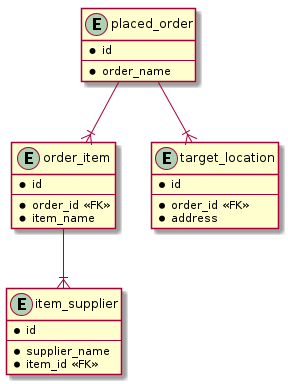

# Test case

## Database entities in tests

@startuml db_schema

hide empty members

entity placed_order {
*id
--
*order_name
}

entity order_item {
*id
--
*order_id <<FK>>
*item_name
}

entity target_location {
*id
--
*order_id <<FK>>
*address
}

entity item_supplier {
*id
--
*supplier_name
*item_id <<FK>>
}

placed_order --|{ target_location
placed_order --|{ order_item
order_item --|{ item_supplier

@enduml

